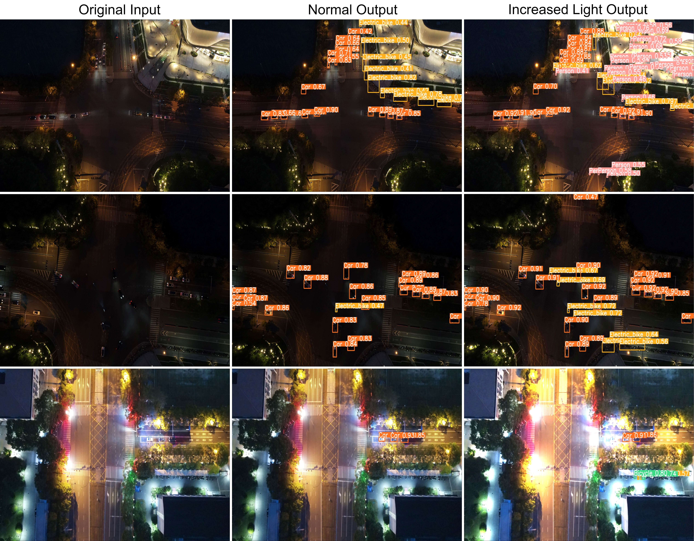
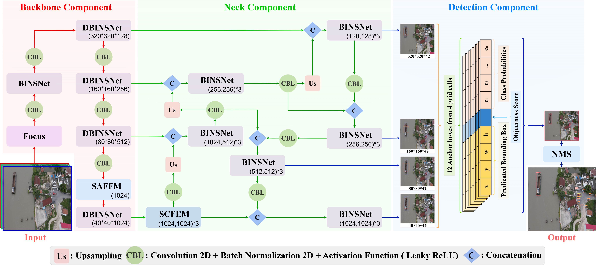
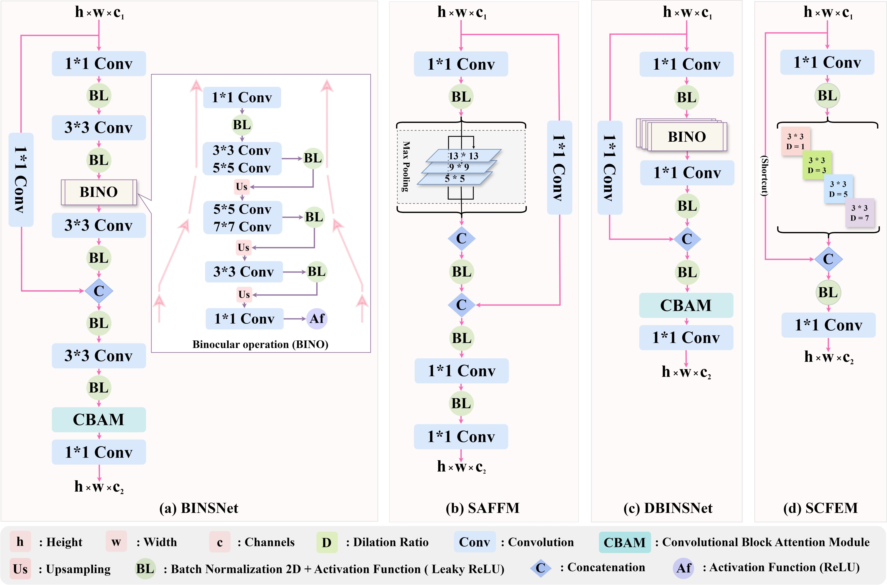
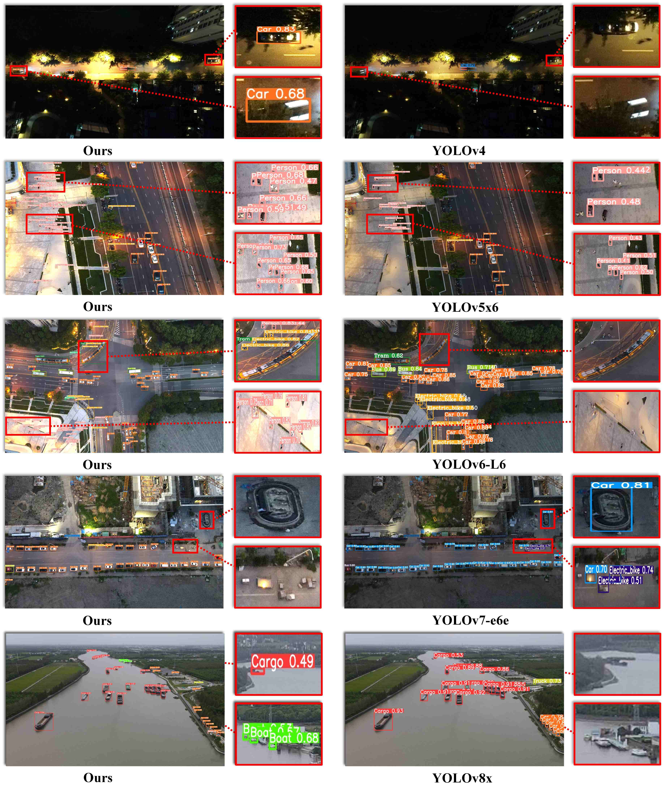
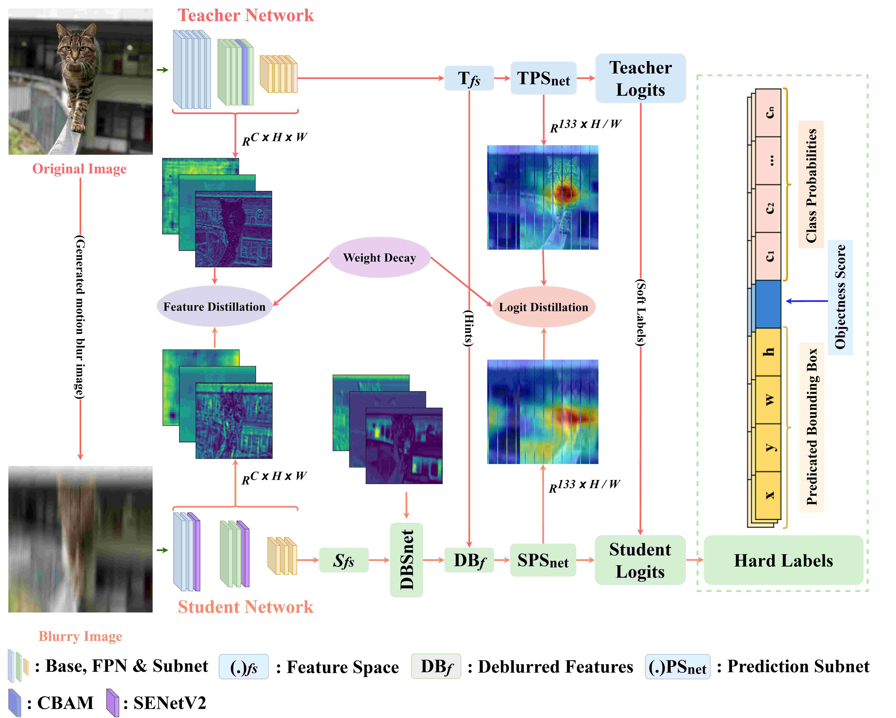
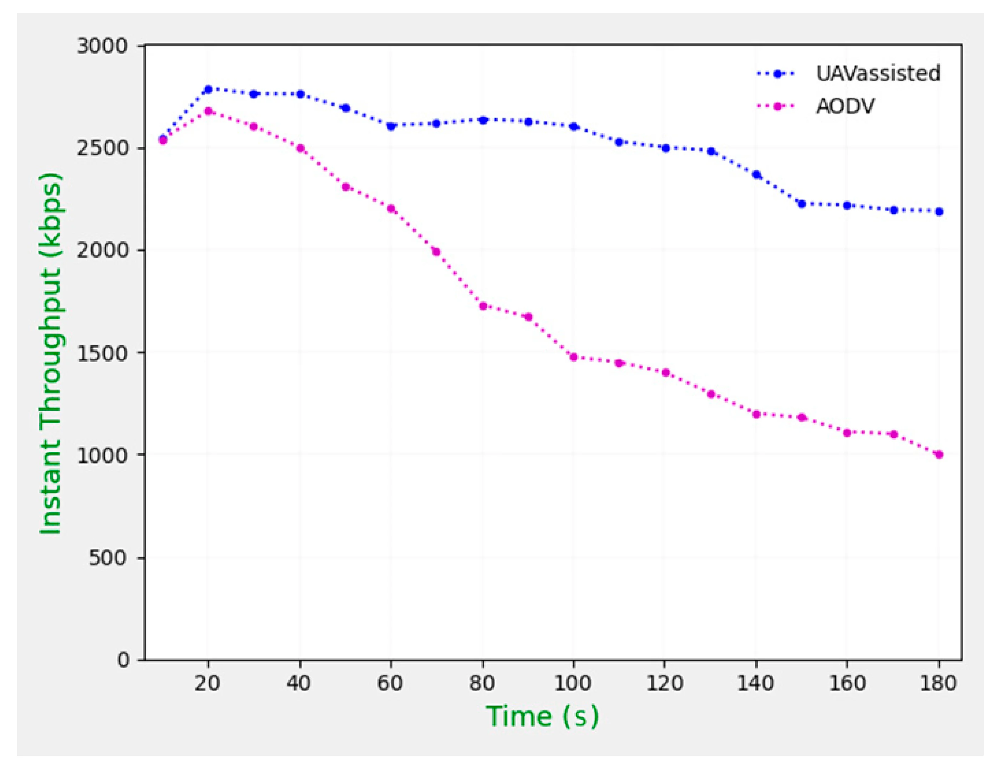
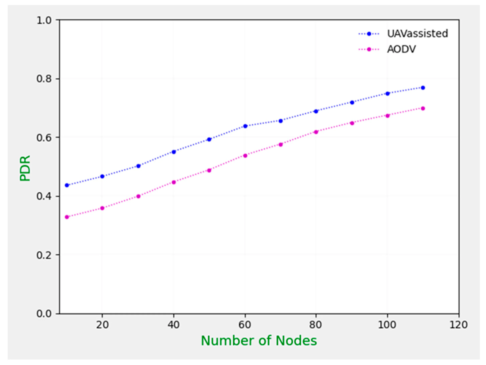
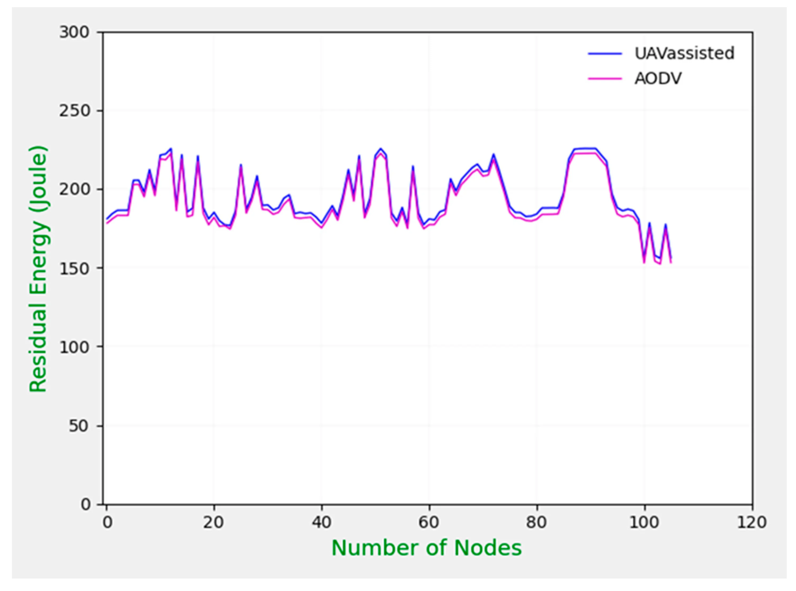
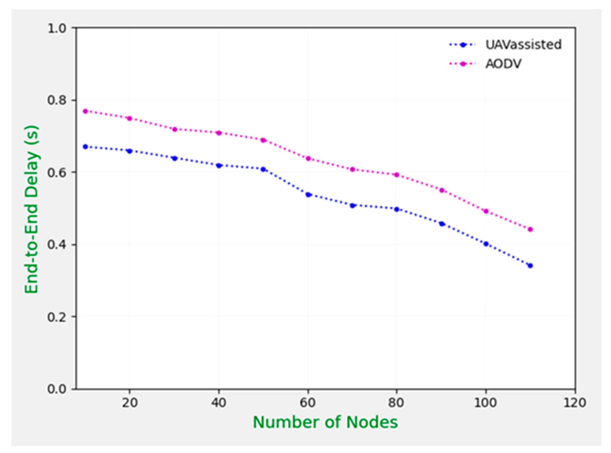

COO & Co-Founder, Shanghai Auribay Technology Co., Ltd.

---

## Academic Background

I received my Bachelor’s degree in Electronics and Telecommunication Engineering from Daffodil International University, Bangladesh, in December 2014. After graduation, I worked as a Field Support Engineer at CFVL Myanmar Company Ltd., where I gained hands-on experience with Huawei, Ericsson, and Nokia telecommunication systems.

In September 2018, I was awarded the Chinese Government Scholarship and moved to China to pursue graduate studies. I completed my Master’s degree in Information and Communication Engineering at Donghua University, Shanghai, China, in 2021. Following my master’s studies, I received the Shanghai Government Scholarship to pursue my Ph.D. at the same institution.

I completed my Ph.D. in Information and Communication Intelligent Systems in June 2025. My doctoral research focused on effective object detection in unmanned aerial vehicle (UAV) imagery for complex environmental applications. I am currently co-running a technology company in Shanghai, where I am engaged in research-driven product development and industry-oriented innovation.

---

## Honors and Awards

- **Excellent International Graduate Award**, Donghua University, China (2025)  
  Conferred for exceptional academic achievement and comprehensive excellence throughout the Ph.D. program.

- **Outstanding International Student Award**, Donghua University, China (2024)  
  Awarded for excellent academic performance and active participation in university activities.

- **Certificate of Merit for Social Work**,  
  International Cultural Exchange School, Donghua University (Spring 2023)  
  Awarded in recognition of contributions to social and cultural activities.

- **Shanghai Government Scholarship** for Ph.D. Study, China (2021)  
  Awarded for doctoral study at Donghua University.

- **Chinese Government Scholarship** for Master’s Study, China (2018)  
  Awarded for full-time master’s study at Donghua University.

- **Certificate of Honor for Outstanding Performance**,  
  International Cultural Exchange School, Donghua University (2019)  
  Awarded for outstanding performance during the International Cultural Festival of Donghua University.
---

## Publications

Please refer to my  
👉 [Google Scholar Profile](https://scholar.google.com/citations?user=fCM8lL8AAAAJ&hl=en&oi=ao)

---

## Research Interests
- Small Object Detection  
- UAV-based Computer Vision  
- Lightweight Deep Learning Models  
- Object Detection in Complex Environments  
- Real-Time Vision Systems 
- 3D Plant Phenotyping  
- Point Cloud Processing and Learning  
- Deep Learning for Agriculture  
- Generative Models (GANs, Diffusion Models)  

---
## Upcoming & Ongoing Projects

### LiteUAV-Det: A Lightweight Network for Robust Small-Object Detection in Complex Aerial Scenes

**Sayed Jobaer**†, A. A. M. Muzahid, Muhammad Ather Iqbal Hussain †, Foysal Ahmed †, Xiaoshan Bai, Hua Han, Ferdous Sohel  
† Contributed equally.

**Brief Description:**  

LiteUAV-Det is a robust lightweight object detection framework designed for small, flat, fast-moving, and motion-blurred objects in challenging UAV scenarios. It targets complex aerial environments characterized by high altitude, low illumination, and severe motion blur, where conventional SOTA detectors often fail due to strong pixel-level similarity between targets and background.

## LiteUAV-Det Architecture Overview

<table border="0">
  <tr>
    <td align="center">
      
       
      <em> A schematic illustration of the detector architecture for small object recognition.</em>
    </td>
  </tr>
</table>
  
**Resources**  
- 📄 **Paper:** to be published
- 💻 **Code:** https://github.com/dhuvisionlab/LiteUAV-Det

**Outperforms comparable lightweight detectors**

- Achieves +4.2% mAP on VisDrone2019 and +2.9% mAP on UAV-SOD compared to YOLOv9s (7.17M parameters).

<table border="0">
  
  <tr>
    <th>Dataset</th>
    <th>mAP0.5:0.95</th>
    <th>Inference Time</th>
    <th>FPS</th>
  </tr>
  <tr>
    <td>UAV-SOD</td>
    <td><b>34.5%</b></td>
    <td><b>2.4 ms</b></td>
    <td><b>214</b></td>
  </tr>
  <tr>
    <td>VisDrone2019</td>
    <td><b>33.8%</b></td>
    <td><b>2.3 ms</b></td>
    <td><b>300</b></td>
  </tr>
</table>

  

**Results**   

<table>
  <thead>
    <tr>
      <th>Methods</th>
      <th>Backbone</th>
      <th>FLOPs (G)</th>
      <th>Params (M)</th>
      <th>Layers</th>
      <th>mAP0.50val</th>
      <th>mAP0.50–0.95val</th>
      <th>Model Size (MB)</th>
      <th>Inference Time (ms)</th>
      <th>FPS</th>
    </tr>
  </thead>
  <tbody>
    <tr>
      <td>YOLOv5s</td><td>CSPDarknet-53</td><td><b>16.8</b></td><td>12.60</td><td>193</td><td><b>53.7</b></td><td>34.3</td><td>17.7</td><td>2.5</td><td>211.0</td>
    </tr>
    <tr>
      <td>YOLOv6s</td><td>EfficientRep</td><td>45.3</td><td>18.50</td><td><b>142</b></td><td>53.5</td><td>34.2</td><td>31.3</td><td>2.7</td><td>168.8</td>
    </tr>
    <tr>
      <td>YOLOv7</td><td>RepConvN</td><td>103.3</td><td>36.52</td><td>314</td><td>53.2</td><td>34.4</td><td>74.9</td><td>4.4</td><td>71.3</td>
    </tr>
    <tr>
      <td>YOLOv8s</td><td>CSPDarknet-53</td><td>28.5</td><td>11.12</td><td>168</td><td>51.2</td><td>33.8</td><td>21.5</td><td>2.7</td><td>193.4</td>
    </tr>
    <tr>
      <td>YOLOv9s</td><td>RepConvN</td><td>26.7</td><td>7.17</td><td>486</td><td>48.5</td><td>30.9</td><td>15.2</td><td>3.9</td><td>79.3</td>
    </tr>
    <tr>
      <td>YOLOv10s</td><td>CSPDarknet-53</td><td>24.5</td><td>8.04</td><td>293</td><td>49.0</td><td>31.8</td><td>16.5</td><td>3.3</td><td>95.3</td>
    </tr>
    <tr>
      <td>YOLOv11s</td><td>CSPDarknet-53</td><td>21.5</td><td>9.40</td><td>181</td><td>51.6</td><td>33.7</td><td>18.4</td><td>2.5</td><td>198.4</td>
    </tr>
    <tr>
      <td>YOLOv12s</td><td>EfficientViT</td><td>19.7</td><td>9.30</td><td>497</td><td>52.0</td><td>33.2</td><td>17.8</td><td>2.6</td><td>187.2</td>
    </tr>
    <tr>
      <td>YOLOv13s</td><td>CSPDarknet-53</td><td>20.8</td><td>9.10</td><td>687</td><td>52.2</td><td>33.5</td><td>35.2</td><td>3.0</td><td>120.6</td>
    </tr>
    <tr>
      <td>YOLO-JD</td><td>CSPDarknet-53</td><td>22.3</td><td>7.41</td><td>186</td><td>48.4</td><td>30.3</td><td>18.8</td><td>3.2</td><td>173.7</td>
    </tr>
    <tr>
      <td>SSD</td><td>VGG16</td><td>34.8</td><td>138.00</td><td>–</td><td>41.6</td><td>23.4</td><td>104.0</td><td>40.3</td><td>21.2</td>
    </tr>
    <tr>
      <td>RetinaNet</td><td>ResNet-101</td><td>85.4</td><td>57.50</td><td>–</td><td>46.7</td><td>28.5</td><td>146.2</td><td>12.4</td><td>76.4</td>
    </tr>
    <tr>
      <td>GLSAN</td><td>Cascade R-CNN</td><td>2186.7</td><td>590.86</td><td>–</td><td>51.4</td><td>31.4</td><td>14.7</td><td>67.6</td><td>12.7</td>
    </tr>
    <tr>
      <td>DMNet</td><td>Faster R-CNN</td><td>4492.1</td><td>228.43</td><td>–</td><td>46.8</td><td>32.8</td><td>315.0</td><td>175.4</td><td>5.3</td>
    </tr>
    <tr>
      <td>DINO</td><td>ResNet-50</td><td>475.6</td><td>46.98</td><td>–</td><td>47.8</td><td>30.8</td><td>84.1</td><td>157.3</td><td>4.8</td>
    </tr>
    <tr>
      <td>RT-DETR</td><td>ResNet-50</td><td>125.7</td><td>45.42</td><td>–</td><td>43.9</td><td>27.5</td><td>23.94</td><td>9.5</td><td>98.7</td>
    </tr>
    <tr>
      <td>QueryDet</td><td>ResNet-50</td><td>96.7</td><td>36.54</td><td>–</td><td>36.8</td><td>23.8</td><td>142.2</td><td>205.7</td><td>2.6</td>
    </tr>
    <tr>
      <td>CZ Det</td><td>ResNet-101</td><td>161.2</td><td>45.99</td><td>–</td><td>49.2</td><td>32.2</td><td>86.2</td><td>85.8</td><td>9.3</td>
    </tr>
    <tr>
      <td><b>LiteUAV-Det (Ours)</b></td>
      <td>CSPDarknet-53</td>
      <td>17.2</td>
      <td><b>6.38</b></td>
      <td>204</td>
      <td>53.4</td>
      <td><b>34.5</b></td>
      <td><b>12.4</b></td>
      <td><b>2.4</b></td>
      <td><b>213.9</b></td>
    </tr>
  </tbody>
</table>

  

  <b>Figure.</b> A comparison of the same input image before and after applying brightness enhancement techniques.

---

## Upcoming & Ongoing Projects

### 🌶️ Pepper-4D — 4D Plant Point Cloud Dataset

  

**Resources**  
- 📄 **Paper:** to be published
- 💻 **Code:** [https://github.com/  ](https://github.com/foysalahmed10/Pepper-4D)

**Introduction**  

Three-dimensional (3D) plant phenotyping plays a crucial role in analyzing
plant structure, organ-level traits, and growth dynamics.
While recent advances in 2D and 3D vision have accelerated research in plant
phenotyping, publicly available **spatiotemporal 3D datasets for pepper plants**
remain extremely limited.

Pepper-4D addresses this gap by providing a **comprehensive 4D (3D + time) point
cloud dataset** capturing the complete growth and developmental process of
pepper plants under controlled indoor conditions.
The dataset enables detailed analysis of plant structure, organ dynamics,
temporal growth patterns, and plant health status.
Pepper-4D is designed as a benchmark resource for both discriminative and
generative learning methods on 3D plant point clouds.

**Dataset Overview**   

- **Species:** Pepper (*Capsicum annuum*)
- **Total plants:** 29
- **Total point clouds:** 916
- **Total points:** 322.72 million
- **Total dataset size:** ~20 GB
- **Data modality:** 3D point clouds (XYZ)
- **Temporal resolution:** Bi-daily scans
- **Environment:** Indoor controlled conditions

**Comparison with Existing 3D Crop Datasets**   

The following table provides a high-level comparison between Pepper-4D and
representative publicly available 3D crop datasets.

<table align="center">
  <thead>
    <tr>
      <th align="center">Dataset</th>
      <th align="center">Species</th>
      <th align="center"># Point Clouds</th>
      <th align="center"># Temporal Coverage (4D)</th>
      <th align="center">Acquisition Modality</th>
      <th align="center">Color</th>
    </tr>
  </thead>
  <tbody>
    <tr>
      <td align="center">Conn et al. (2017)</td>
      <td align="center">Tomato, Tobacco, Sorghum</td>
      <td align="center">558</td>
      <td align="center">Yes</td>
      <td align="center">Laser</td>
      <td align="center">No</td>
    </tr>
    <tr>
      <td align="center">ROSE-X (2020)</td>
      <td align="center">Rose</td>
      <td align="center">11</td>
      <td align="center">No</td>
      <td align="center">X-ray CT</td>
      <td align="center">No</td>
    </tr>
    <tr>
      <td align="center">Pheno4D (2021)</td>
      <td align="center">Maize, Tomato</td>
      <td align="center">126</td>
      <td align="center">Yes</td>
      <td align="center">Laser</td>
      <td align="center">No</td>
    </tr>
    <tr>
      <td align="center">Soybean-MVS (2023)</td>
      <td align="center">Soybean</td>
      <td align="center">102</td>
      <td align="center">Yes</td>
      <td align="center">MVS</td>
      <td align="center">Yes</td>
    </tr>
    <tr>
      <td align="center">PLANesT-3D (2024)</td>
      <td align="center">Pepper, Rose, Ribes</td>
      <td align="center">34</td>
      <td align="center">No</td>
      <td align="center">SfM-MVS</td>
      <td align="center">Yes</td>
    </tr>
    <tr>
      <td align="center">BonnBeetClouds3D (2024)</td>
      <td align="center">Sugar Beet</td>
      <td align="center">3000</td>
      <td align="center">No</td>
      <td align="center">UAV Photogrammetry</td>
      <td align="center">Yes</td>
    </tr>
    <tr>
      <td align="center">Crops3D (2024)</td>
      <td align="center">Multiple species</td>
      <td align="center">1230</td>
      <td align="center">Partial</td>
      <td align="center">SfM-MVS, TLS</td>
      <td align="center">Yes</td>
    </tr>
    <tr>
      <td align="center">MaizeField3D (2025)</td>
      <td align="center">Maize</td>
      <td align="center">1045</td>
      <td align="center">No</td>
      <td align="center">TLS + Procedural</td>
      <td align="center">Yes</td>
    </tr>
    <tr>
      <td align="center"><b>Pepper-4D (2026)</b></td>
      <td align="center"><b>Pepper</b></td>
      <td align="center"><b>916</b></td>
      <td align="center"><b>Yes</b></td>
      <td align="center"><b>SfM + NeRF</b></td>
      <td align="center"><b>Yes</b></td>
    </tr>
  </tbody>
</table>

**Dataset Acquisition and Reconstruction**   

  

Pepper-4D was constructed through a multi-stage pipeline including image
acquisition, preprocessing, 3D reconstruction, and plant-only point cloud
generation. Multi-view images were captured for each plant at each time step,
followed by 3D reconstruction and post-processing to obtain temporally aligned
point clouds.

**Dataset Subsets**   

Pepper-4D consists of three subsets capturing different growth scenarios and
phenotyping tasks.

**Subset 1 — Full Lifecycle**   

  

- **Plants:** 11  
- **Point clouds:** 460  
- **Description:**  
  Long-term monitoring from early vegetative growth to flowering,
  fruiting, and senescence.
- **Annotations:**  
  Semantic, instance, temporal, and health labels.

**Subset 2 — Geotropism Tests**    

  

- **Plants:** 8  
- **Point clouds:** 238  
- **Description:**  
  Sequences focusing on **new organ detection and Geotropism tests**.
- **Annotations:**  
  New organ detection labels.

**Subset 3 — Early–Mid Growth**   

- **Plants:** 10  
- **Point clouds:** 218  
- **Description:**  
  Early and mid growth stages with rapid structural changes.
- **Annotations:**  
  None 

---

### A deep neural network for small object detection in complex environments with unmanned aerial vehicle imagery

**Sayed Jobaer**, Xue-song Tang, Yihong Zhang,  
<strong>Engineering Applications of Artificial Intelligence</strong>, 2025.  

**Brief Description:**  

YOLO-SOD is a YOLOv5-based small object detection framework designed for complex UAV environments. It addresses challenges caused by high-altitude views, low-light conditions, and strong object–background similarity by introducing a Luna-enhancement mechanism, four novel detection modules, and a dedicated SOD dataset. The approach significantly improves detection accuracy and robustness for small and flat objects in aerial imagery.

 

## YOLO-SOD Architecture Overview

<table border="0">
  <tr>
    <td align="center">
      
       
      <em>YOLO-SOD adopts a well-structured detection framework consisting of three key components: a robust backbone for feature extraction, an enhanced neck for multi-scale feature fusion, and a detection head for accurate object localization and classification.</em>
    </td>
  </tr>
</table>
<table border="0">
  <tr>
    <td align="center">
      
       
      <em>Overview of key YOLO-SOD modules: (a) Binocular Shape Network (BINSNet), (b) Scale-Adaptive Feature Fusion Module (SAFFM), (c) Deep Binocular Shape Network (DBINSNet), and (d) Special Context Feature Enhancement Module (SCFEM).</em>
    </td>
  </tr>
</table>

**Resources**  
- 📄 **Paper:** [https://doi.org/10.1016/j.engappai.2025.110466]
- 💻 **Code:** *(https://github.com/dhuvisionlab/SOD)*  

**Results**

<table>
  <thead>
    <tr>
      <th>Methods</th>
      <th>Backbone</th>
      <th>mAP50–95</th>
      <th>AP50</th>
      <th>AP75</th>
      <th>APS</th>
      <th>APM</th>
      <th>APL</th>
      <th>Params (M)</th>
      <th>GFLOPs</th>
      <th>Inference Time (ms)</th>
      <th>FPS</th>
    </tr>
  </thead>
  <tbody>
    <tr><td>YOLOv4</td><td>CSPDarknet-53</td><td>27.8</td><td>46.6</td><td>31.2</td><td>21.4</td><td>35.6</td><td>40.7</td><td>0.52</td><td>0.0615</td><td>7.5</td><td>109.8</td></tr>
    <tr><td>YOLOv4-tiny</td><td>–</td><td>19.7</td><td>39.8</td><td>26.5</td><td>17.5</td><td>23.7</td><td>30.6</td><td><b>0.30</b></td><td><b>0.0068</b></td><td>6.3</td><td>112.3</td></tr>

    <tr><td>YOLOv5n6</td><td>CSPDarknet-53</td><td>31.5</td><td>47.9</td><td>35.2</td><td>24.2</td><td>35.1</td><td>46.3</td><td>3.10</td><td>4.30</td><td>4.9</td><td>153.8</td></tr>
    <tr><td>YOLOv5s6</td><td>–</td><td>36.2</td><td>54.8</td><td>42.6</td><td>26.8</td><td>36.7</td><td>48.6</td><td>12.30</td><td>16.20</td><td>7.9</td><td>105.2</td></tr>
    <tr><td>YOLOv5m6</td><td>–</td><td>41.5</td><td>61.6</td><td>48.6</td><td>29.6</td><td>37.5</td><td>51.3</td><td>48.90</td><td>49.00</td><td>15.7</td><td>57.1</td></tr>
    <tr><td>YOLOv5l6</td><td>–</td><td>42.0</td><td>61.2</td><td>53.1</td><td>29.1</td><td>38.9</td><td>43.4</td><td>112.50</td><td>110.00</td><td>24.7</td><td>38.3</td></tr>
    <tr><td>YOLOv5x6</td><td>–</td><td>39.6</td><td>60.6</td><td>47.2</td><td>30.7</td><td>39.4</td><td>56.7</td><td>140.00</td><td>208.10</td><td>27.2</td><td>36.7</td></tr>

    <tr><td>YOLOv6-N6</td><td>EfficientRep</td><td>28.9</td><td>44.8</td><td>36.9</td><td>11.4</td><td>23.9</td><td>44.9</td><td>10.30</td><td>49.59</td><td>4.4</td><td>163.6</td></tr>
    <tr><td>YOLOv6-S6</td><td>–</td><td>31.6</td><td>47.4</td><td>39.3</td><td>13.5</td><td>28.4</td><td>47.1</td><td>41.33</td><td>197.55</td><td>11.1</td><td>77.5</td></tr>
    <tr><td>YOLOv6-M6</td><td>–</td><td>33.0</td><td>52.0</td><td>41.4</td><td>14.8</td><td>33.0</td><td>55.3</td><td>79.45</td><td>378.28</td><td>24.3</td><td>38.0</td></tr>
    <tr><td>YOLOv6-L6</td><td>–</td><td>44.3</td><td>63.0</td><td>53.4</td><td>16.4</td><td>34.4</td><td>56.7</td><td>140.22</td><td>672.51</td><td>47.4</td><td>20.4</td></tr>

    <tr><td>YOLOv7-w6</td><td>RepConvN</td><td>45.2</td><td>64.3</td><td>52.2</td><td>25.6</td><td>36.7</td><td>53.6</td><td>81.00</td><td>102.70</td><td>14.2</td><td>61.7</td></tr>
    <tr><td>YOLOv7-e6</td><td>–</td><td>48.0</td><td>69.0</td><td>55.7</td><td>27.4</td><td>37.6</td><td>57.5</td><td>110.53</td><td>143.70</td><td>22.0</td><td>41.8</td></tr>
    <tr><td>YOLOv7-d6</td><td>–</td><td>45.4</td><td>64.9</td><td>53.1</td><td>28.7</td><td>39.7</td><td>54.2</td><td>153.00</td><td>197.50</td><td>26.8</td><td>34.7</td></tr>
    <tr><td>YOLOv7-e6e</td><td>–</td><td>46.8</td><td>67.2</td><td>54.7</td><td>31.4</td><td>41.2</td><td>57.3</td><td>165.00</td><td>227.00</td><td>33.3</td><td>28.4</td></tr>

    <tr><td>YOLOv8n</td><td>CSPDarknet-53</td><td>37.5</td><td>54.4</td><td>43.6</td><td>23.6</td><td>33.2</td><td>40.2</td><td>3.00</td><td>8.10</td><td><b>1.7</b></td><td><b>277.2</b></td></tr>
    <tr><td>YOLOv8s</td><td>–</td><td>38.3</td><td>56.1</td><td>45.2</td><td>24.4</td><td>35.4</td><td>44.3</td><td>11.12</td><td>28.50</td><td>3.3</td><td>172.4</td></tr>
    <tr><td>YOLOv8m</td><td>–</td><td>40.5</td><td>58.4</td><td>47.8</td><td>26.1</td><td>36.7</td><td>45.3</td><td>25.80</td><td>78.70</td><td>6.6</td><td>112.3</td></tr>
    <tr><td>YOLOv8l</td><td>–</td><td>42.4</td><td>59.5</td><td>49.6</td><td>28.9</td><td>37.3</td><td>46.5</td><td>43.60</td><td>164.90</td><td>12.0</td><td>72.9</td></tr>
    <tr><td>YOLOv8x</td><td>–</td><td>44.7</td><td>61.8</td><td>51.3</td><td>30.5</td><td>39.4</td><td>48.5</td><td>68.10</td><td>257.40</td><td>17.5</td><td>53.1</td></tr>

    <tr>
      <td><b>YOLO-SOD (Ours)</b></td>
      <td>CSPDarknet-53</td>
      <td><b>51.7</b></td>
      <td><b>71.5</b></td>
      <td><b>61.9</b></td>
      <td><b>34.5</b></td>
      <td><b>43.5</b></td>
      <td><b>61.7</b></td>
      <td>145.60</td>
      <td>235.20</td>
      <td>32.7</td>
      <td>30.6</td>
    </tr>
  </tbody>
</table>

 

<table border="0">
  <tr>
    <td align="center">
      
       
      <em>Visual comparison of YOLO-SOD with five alternative YOLO models (v4-v8) on the SOD-Dataset.</em>
    </td>
  </tr>
</table>

---

### A Novel Knowledge Distillation Framework for Enhancing Small Object Detection in Blurry Environments with UAV-Assisted Images

Sayed Jobaer, Xue-song Tang, Yihong Zhang, Gaojian Li, **Foysal Ahmed**  
<strong>Complex & Intelligent Systems</strong>, 2025.  

**Brief Description:**  

This paper proposes a novel knowledge distillation framework to enhance small object detection performance in blurry UAV-assisted images.  
The method integrates attention-guided feature distillation and a feature-level deblurring subnet within a self-supervised learning paradigm, enabling robust detection without relying on explicit image deblurring. Experimental results on VisDrone and a newly developed UAV small object detection dataset demonstrate consistent performance improvements over state-of-the-art methods.

 

## KD Models Overview

<table border="0">
  <tr>
    <td align="center">
      
       
      <em>Overview of our proposed knowledge distillation of the framework.</em>
    </td>
  </tr>
</table>
<table border="0">
  <tr>
    <td align="center">
      
       
      <em>Overview of the proposed knowledge distillation and feature-level deblurring framework.</em>
    </td>
  </tr>
</table>

**Resources**  
- 📄 **Paper:** [https://doi.org/10.1007/s40747-024-01676-w  ](https://link.springer.com/article/10.1007/s40747-024-01676-w)
- 💻 **Code:** *(to be released)*  

**Rersults**

<table>
  <thead>
    <tr>
      <th rowspan="2">Method</th>
      <th colspan="2">Sharp</th>
      <th colspan="2">20%</th>
      <th colspan="2">40%</th>
      <th colspan="2">60%</th>
      <th colspan="2">80%</th>
      <th colspan="2">100%</th>
    </tr>
    <tr>
      <th>F1</th><th>mAP</th>
      <th>F1</th><th>mAP</th>
      <th>F1</th><th>mAP</th>
      <th>F1</th><th>mAP</th>
      <th>F1</th><th>mAP</th>
      <th>F1</th><th>mAP</th>
    </tr>
  </thead>
  <tbody>
    <tr><td>Baseline</td><td>70.1</td><td>62.2</td><td>69.2</td><td>61.7</td><td>68.4</td><td>61.2</td><td>67.6</td><td>60.7</td><td>66.8</td><td>60.2</td><td>66.0</td><td>59.7</td></tr>
    <tr><td>Mimicking</td><td>60.8</td><td>54.8</td><td>60.3</td><td>54.5</td><td>59.7</td><td>53.1</td><td>59.1</td><td>52.9</td><td>58.5</td><td>52.6</td><td>58.0</td><td>52.3</td></tr>
    <tr><td>SSKD</td><td>59.8</td><td>49.4</td><td>59.4</td><td>49.0</td><td>58.7</td><td>48.6</td><td>58.1</td><td>48.2</td><td>57.6</td><td>47.9</td><td>57.1</td><td>47.6</td></tr>
    <tr><td>Fine-grained</td><td>61.7</td><td>50.4</td><td>61.2</td><td>49.9</td><td>60.7</td><td>49.5</td><td>60.3</td><td>49.1</td><td>59.8</td><td>48.6</td><td>59.5</td><td>48.4</td></tr>
    <tr><td>OFD</td><td>53.7</td><td>43.8</td><td>53.4</td><td>43.6</td><td>52.8</td><td>43.3</td><td>52.4</td><td>42.9</td><td>51.9</td><td>42.6</td><td>51.6</td><td>42.3</td></tr>
    <tr><td>ReviewKD</td><td>58.3</td><td>48.9</td><td>57.9</td><td>48.6</td><td>57.4</td><td>48.2</td><td>56.9</td><td>47.8</td><td>56.1</td><td>47.5</td><td>54.5</td><td>47.2</td></tr>
    <tr><td>SSD</td><td>58.7</td><td>41.6</td><td>57.3</td><td>41.3</td><td>56.1</td><td>40.8</td><td>53.5</td><td>40.1</td><td>52.6</td><td>39.8</td><td>50.9</td><td>39.6</td></tr>
    <tr><td>RetinaNet</td><td>61.6</td><td>46.7</td><td>61.3</td><td>45.9</td><td>59.4</td><td>45.7</td><td>58.7</td><td>45.3</td><td>57.1</td><td>44.9</td><td>56.7</td><td>44.6</td></tr>
    <tr><td>YOLOv5</td><td>64.2</td><td>59.4</td><td>63.8</td><td>58.7</td><td>63.4</td><td>58.2</td><td>62.8</td><td>57.6</td><td>62.4</td><td>56.8</td><td>62.0</td><td>55.5</td></tr>
    <tr><td>YOLOv6</td><td>68.4</td><td>57.3</td><td>67.8</td><td>56.8</td><td>66.8</td><td>56.2</td><td>66.3</td><td>55.7</td><td>64.9</td><td>55.2</td><td>66.3</td><td>54.8</td></tr>
    <tr><td>YOLOv7</td><td>75.8</td><td>61.7</td><td>74.5</td><td>61.3</td><td>73.4</td><td>60.1</td><td>71.3</td><td>58.6</td><td>69.5</td><td>57.9</td><td>68.8</td><td>57.3</td></tr>
    <tr><td>YOLOv8</td><td>73.4</td><td>65.7</td><td>72.9</td><td>65.2</td><td>72.4</td><td>64.5</td><td>71.9</td><td>63.7</td><td>71.4</td><td>62.9</td><td>69.8</td><td>61.1</td></tr>
    <tr><td>SuperYOLO</td><td>75.2</td><td>65.3</td><td>74.3</td><td>64.8</td><td>73.6</td><td>64.1</td><td>72.5</td><td>63.5</td><td>71.3</td><td>62.8</td><td>70.1</td><td>62.2</td></tr>
    <tr>
      <td><b>Ours</b></td>
      <td><b>76.9</b></td><td><b>66.8</b></td>
      <td><b>75.6</b></td><td><b>66.3</b></td>
      <td><b>74.4</b></td><td><b>65.7</b></td>
      <td><b>73.6</b></td><td><b>65.2</b></td>
      <td><b>72.4</b></td><td><b>64.7</b></td>
      <td><b>71.3</b></td><td><b>64.3</b></td>
    </tr>
  </tbody>
</table>

<table border="0">
  <tr>
    <td align="center">
      
       
      <em>Detection results under different motion speeds on the SOD-Dataset. As motion speed increases, detection becomes more challenging. Existing methods struggle with small and blurry objects beyond 40% motion speed, while our approach better deblurs the scene and maintains more reliable detection performance.</em>
    </td>
  </tr>
</table>

---

### UAV-Assisted Hybrid Scheme for Urban Road Safety Based on VANETs

Sayed Jobaer, Yihong Zhang*, Muhammad Ather Iqbal Hussain, **Foysal Ahmed** 
<strong>Electronics</strong>, 2020. 
*Corresponding author.*

**Brief Description:**  
This paper proposes a UAV-assisted hybrid routing framework for urban vehicular ad hoc networks (VANETs) to improve road safety and congestion control. By integrating unmanned aerial vehicles (UAVs) with roadside units and vehicular communication, the proposed scheme enhances packet delivery ratio, reduces end-to-end delay, and improves energy efficiency under realistic urban traffic conditions.

## VANET Overview

<table border="0">
  <tr>
    <td align="center">
      
       
      <em>UAV-assisted VANET architecture for urban traffic congestion control.</em>
    </td>
  </tr>
</table>

**Resources**  
- 📄 **Paper:** [https://www.mdpi.com/2079-9292/9/9/1499](https://doi.org/10.3390/electronics9091499)
- 💻 **Code:** *(to be released)*  

**Rersults**
<table border="0">
  <tr>
    <td align="center">
       
      <b>(a)</b> Instant throughput.
    </td>
    <td align="center">
       
      <b>(b)</b> Packet delivery ratio.
    </td>
    <td align="center">
       
      <b>(c)</b> Residual energy.
    </td>
    <td align="center">
       
      <b>(d)</b> End-to-end delay.
    </td>
  </tr>
</table>

---

<!-- Visitor Statistics (Footer) -->

  <!-- Page View Counter -->
  

    Page views: —
  

  <!-- Visitor Map -->
  

    
  

<!-- Busuanzi Counter Script -->

